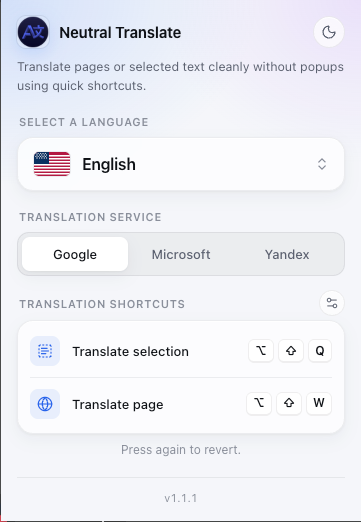
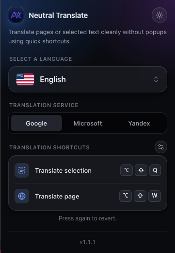

# Neutral Translate

Neutral Translate is a private inline translator made specifically for the Helium browser. It translates web pages and selected text in place, using the translation service you choose, and sends as little of your data as possible. Fast shortcuts keep the workflow fluid while the interface stays clean.

- Helium Browser and most other Chromium-based browsers
- Google Chrome
- Microsoft Edge

<p align="center">
  
  
</p>

<p align="center">
  Based on Helium Inline Translator by Wesley Martins
</p>


## Why "Neutral"

Neutral Translate was built for the Helium browser to keep translation as private as the rest of your browsing: what you translate should not be linked to your Google, Microsoft, or Yandex account, and you should not be locked into one translation company. That is exactly why the translation provider is your choice: Google Translate, Microsoft Translator, or Yandex Translate. Switch services in the popup at any time, for example when another service handles a language better or when you trust a different company's privacy policy more. All three services are free and need no account or API key. The extension has no server of its own, so the only party that receives your text is the service you picked.

## Privacy by Design

- **No cookies:** translation requests are sent without cookies or login sessions, so your text is not tied to your signed-in Google, Microsoft, or Yandex account.
- **Only what is needed:** each request contains just the text to translate and the target language. The page address, page title, browsing history, and your identity are never sent.
- **Private input is never sent:** passwords and other form fields, text areas, message drafts, rich text editors, hidden text such as closed menus, and content inside embedded frames are skipped.
- **Works only on request:** the extension reads a page only after you press a shortcut or use the right-click menu, and only in that tab.
- **Minimal permissions:** network access is limited to the three translation services.
- **No analytics, no ads, no trackers.**

The text you translate is still sent to the service you selected, which handles it under its own privacy policy and sees your IP address. See the [privacy policy](docs/PrivacyPolicy.md) for details.

## Features

- Inline translation for full pages and highlighted passages
- Free translation services without an API key: Google, Microsoft, and Yandex, selectable in the popup
- Keyboard shortcuts: `Shift + Alt + Q` (selection) and `Shift + Alt + W` (page), customizable at `chrome://extensions/shortcuts`
- Minimal popup with light and dark themes
- Favorite languages, quick search, and complete UI localization
- Store metadata localized via `_locales/<lang>/messages.json`

## Supported Languages (49)

| Region | Languages |
|--------|-----------|
| **Portuguese** | Português (Brasil) 🇧🇷, Português (Portugal) 🇵🇹 |
| **Western Europe** | English 🇺🇸, Español 🇪🇸, Français 🇫🇷, Deutsch 🇩🇪, Italiano 🇮🇹, Nederlands 🇳🇱, Català 🇦🇩, Gaeilge 🇮🇪 |
| **Central Europe** | Lëtzebuergesch 🇱🇺, Malti 🇲🇹 |
| **Eastern Europe** | Русский 🇷🇺, Українська 🇺🇦, Polski 🇵🇱, Čeština 🇨🇿, Slovenčina 🇸🇰, Magyar 🇭🇺, Română 🇷🇴, Български 🇧🇬, Hrvatski 🇭🇷, Slovenščina 🇸🇮, Српски 🇷🇸 |
| **Scandinavia & Baltics** | Svenska 🇸🇪, Dansk 🇩🇰, Norsk 🇳🇴, Suomi 🇫🇮, Íslenska 🇮🇸, Eesti 🇪🇪, Latviešu 🇱🇻, Lietuvių 🇱🇹 |
| **East Asia** | 日本語 🇯🇵, 한국어 🇰🇷, 中文 (简体) 🇨🇳, 中文 (繁體) 🇹🇼 |
| **Southeast Asia** | Tiếng Việt 🇻🇳, Bahasa Indonesia 🇮🇩, ไทย 🇹🇭, Bahasa Melayu 🇲🇾, Filipino 🇵🇭 |
| **South Asia** | हिन्दी 🇮🇳, বাংলা 🇧🇩, اردو 🇵🇰 |
| **Middle East** | العربية 🇸🇦, עברית 🇮🇱, فارسی 🇮🇷 |
| **Mediterranean** | Türkçe 🇹🇷, Ελληνικά 🇬🇷 |
| **Africa** | Afrikaans 🇿🇦 |

## Disclaimer

This extension uses Google Translate, Microsoft Translator, and Yandex Translate to provide translations but is not affiliated with, endorsed, or sponsored by Google, Microsoft, or Yandex. All copyrights and trademarks belong to their respective owners.

## Known Limitations

- Due to browser security restrictions, this extension cannot run on internal pages (e.g., `chrome://`, `edge://`) or on the Chrome Web Store / Edge Add-ons website itself.
- Translation relies on an external service and requires an active internet connection.

### Manual installation (development build)

1. Clone this repository or download the latest release ZIP.
2. Open `chrome://extensions` (or `edge://extensions`) and enable **Developer mode**.
3. Click **Load unpacked** and choose the project root (`Neutral-Translate`).
4. Use the refresh icon whenever you change local files.

## Development

- Popup assets live in `ui/`.
- `src/background.js` handles keyboard shortcuts and the context menu, and injects `src/content.js` into the active tab on demand; `src/content.js` applies inline translations.
- `src/translation/providers/` holds one adapter per translation service; register new ones in `src/translation/providerRegistry.js`.
- UI strings are defined in `ui/i18n.js`; store messages mirror them under `_locales/`.
- Preferences persist via `chrome.storage.sync` and are restored on load.
- Use the service worker inspector in `chrome://extensions` to review logs.

## Repository Structure

```text
manifest.json
src/
ui/
icons/
_locales/
docs/
```

## Privacy and Support

- Privacy policy: `docs/PrivacyPolicy.md`
- Issues: <https://github.com/buchmark/Neutral-Translate/issues>

## License

Licensed under [GPL v3](LICENSE).
